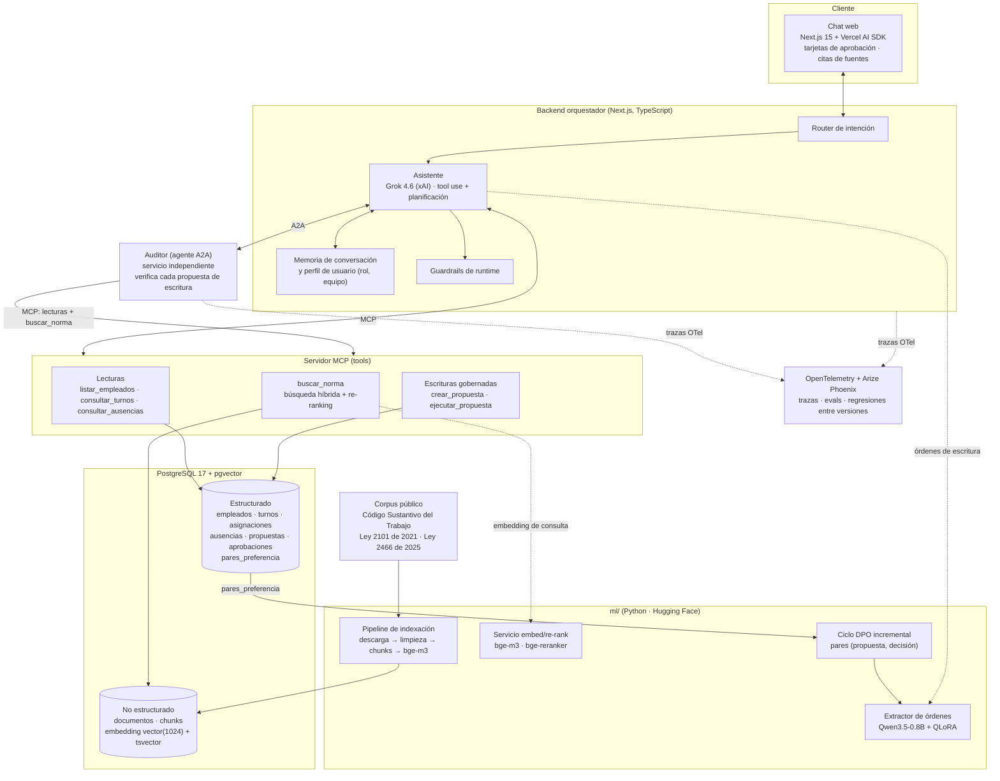

# Figura — componentes de Relevo

Fuente: `docs/ARQUITECTURA.md` §2. El informe la reutiliza tal cual.

```mermaid
flowchart TB
    subgraph CLIENTE["Cliente"]
        UI["Chat web<br/>Next.js 15 + Vercel AI SDK<br/>tarjetas de aprobación · citas de fuentes"]
    end

    subgraph BACK["Backend orquestador (Next.js, TypeScript)"]
        RT["Router de intención"]
        AS["Asistente<br/>Grok 4.6 (xAI) · tool use + planificación"]
        MEM["Memoria de conversación<br/>y perfil de usuario (rol, equipo)"]
        GRD["Guardrails de runtime"]
    end

    AUD["Auditor (agente A2A)<br/>servicio independiente<br/>verifica cada propuesta de escritura"]

    subgraph MCPS["Servidor MCP (tools)"]
        TL["Lecturas<br/>listar_empleados · consultar_turnos · consultar_ausencias"]
        TN["buscar_norma<br/>búsqueda híbrida + re-ranking"]
        TW["Escrituras gobernadas<br/>crear_propuesta · ejecutar_propuesta"]
    end

    subgraph DATOS["PostgreSQL 17 + pgvector"]
        SQL[("Estructurado<br/>empleados · turnos · asignaciones<br/>ausencias · propuestas · aprobaciones<br/>pares_preferencia")]
        VEC[("No estructurado<br/>documentos · chunks<br/>embedding vector(1024) + tsvector")]
    end

    subgraph ML["ml/ (Python · Hugging Face)"]
        IDX["Pipeline de indexación<br/>descarga → limpieza → chunks → bge-m3"]
        EMB["Servicio embed/re-rank<br/>bge-m3 · bge-reranker"]
        EXT["Extractor de órdenes<br/>Qwen3.5-0.8B + QLoRA"]
        DPO["Ciclo DPO incremental<br/>pares (propuesta, decisión)"]
    end

    PHX["OpenTelemetry + Arize Phoenix<br/>trazas · evals · regresiones entre versiones"]
    CORPUS["Corpus público<br/>Código Sustantivo del Trabajo<br/>Ley 2101 de 2021 · Ley 2466 de 2025"]

    UI <--> RT
    RT --> AS
    AS <--> MEM
    AS --> GRD
    AS <-->|MCP| MCPS
    AS <-->|A2A| AUD
    AUD -->|MCP: lecturas + buscar_norma| MCPS
    TL --> SQL
    TW --> SQL
    TN --> VEC
    TN -.->|embedding de consulta| EMB
    CORPUS --> IDX
    IDX --> VEC
    SQL -->|pares_preferencia| DPO
    DPO --> EXT
    AS -.->|órdenes de escritura| EXT
    BACK -.->|trazas OTel| PHX
    AUD -.->|trazas OTel| PHX
```
